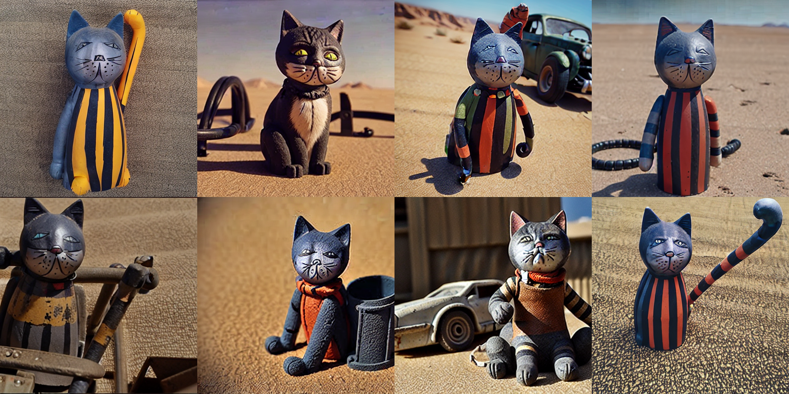

# [`allenai/tango`](https://github.com/allenai/tango) version of [`dreambooth`](https://arxiv.org/abs/2208.12242)

## Install dependencies

```shell
poetry install
```

## Run a tango experiment

```shell
poetry run tango run configs/dreambooth.jsonnet -i dreambooth/ -w workspace
```

## Examples of generated image

- Prompt: `a <cat-toy> in mad max fury road`


